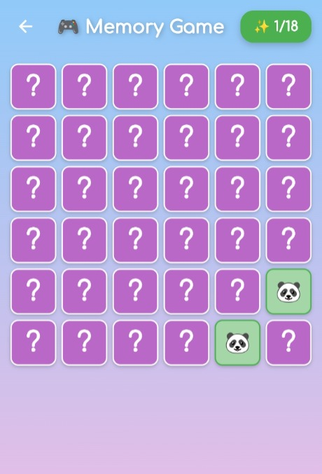
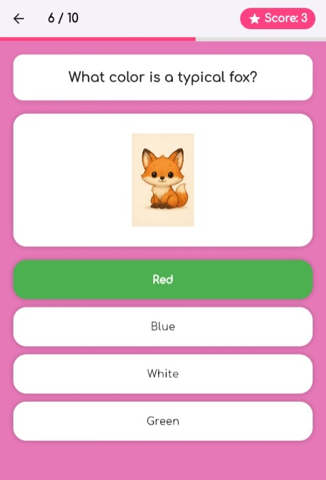
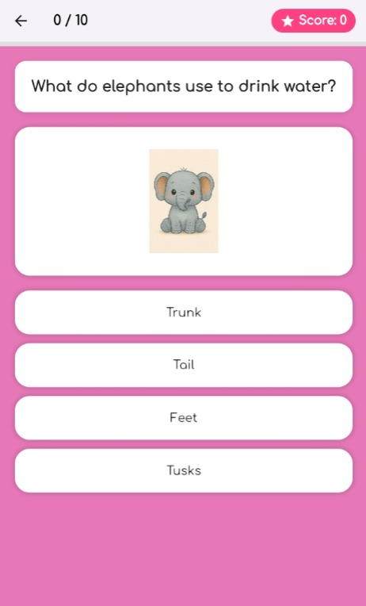

# 🎮 Kidtopia Quiz App

> An interactive, reward-based educational mobile application designed for children aged 4–10.

---

## 📖 About the Project

**Kidtopia** is an educational mobile application designed to make learning fun and engaging for children aged **4 to 10**.

The application combines **interactive educational quizzes** with **reward-based mini-games**. Children can answer questions, earn points, track their progress, and unlock fun games as they improve their scores.

The project was developed using **Flutter and Dart**, with **Firebase** used for data storage and user-related features.

---

## ✨ Features

### 📚 Educational Quizzes

Kidtopia provides quizzes across **8 educational categories**:

* 🐾 Animals
* 🍎 Fruits
* 🥕 Vegetables
* 🚗 Transport
* 🎨 Colors
* 🧍 Body
* ⚽ Sports
* 🔢 Math

Each quiz includes:

* 10 questions
* Child-friendly illustrations
* Multiple-choice answers
* Immediate feedback
* Real-time score display

### 🎮 Reward Mini-Games

Children can unlock mini-games by reaching specific score thresholds.

Available mini-games include:

* 🧠 Memory Game
* 🔗 Matching Game
* 🌈 Rainbow Game
* 🐾 Pet Feeding
* 🎁 Bonus Games

The following screenshot shows one of the mini-games available in Kidtopia:

<p align="center">
  
</p>

---

## 📱 App Screenshots

Here are some screenshots showcasing the Kidtopia application:

<p align="center">
  
  
  
</p>

### 👤 User Profiles & Progress Tracking

Each user has a personalized profile where they can:

* View their total points
* Track quiz scores
* View performance statistics
* Follow their learning progress

### 🔐 Authentication

The application provides:

* Sign Up
* Sign In
* Personalized user accounts
* Secure Firebase-based authentication

### 🌍 Multilingual Support

Kidtopia supports multiple languages and provides a simple, intuitive interface adapted to young learners.

### 🔐 Authentication & Profile

Handles:

* User registration
* User login
* User profiles
* Statistics
* Progress tracking

### 📚 Quiz & Categories

Handles:

* Category selection
* Question and answer data
* Quiz logic
* Score calculation
* Answer feedback

### 🎁 Rewards & Mini-Games

Handles:

* Score-based unlocking
* Memory Game
* Matching Game
* Rainbow Game
* Pet Feeding
* Bonus games

### ☁️ Firebase

Firebase is used for:

* User authentication
* Storing user information
* Storing scores and progress
* Managing application data

---

## 🛠️ Technologies Used

| Technology                  | Purpose                                  |
| --------------------------- | ---------------------------------------- |
| **Flutter**                 | Mobile application development           |
| **Dart**                    | Programming language                     |
| **Firebase Authentication** | User authentication                      |
| **Firebase Firestore**      | Database and data storage                |
| **Figma**                   | UI/UX design                             |
| **Custom Assets**           | Child-friendly visuals and illustrations |

---

## 🚀 Getting Started

### Prerequisites

Before running the application, make sure you have:

* Flutter SDK
* Dart SDK
* Android Studio or VS Code
* Android/iOS emulator or physical device
* A Firebase project

### 1. Clone the Repository

```bash
git clone https://github.com/your-username/kidtopia-quiz-app.git
cd kidtopia-quiz-app
```

### 2. Install Dependencies

```bash
flutter pub get
```

### 3. Configure Firebase

Create a Firebase project and connect it to the Flutter application.

For Android, add:

```text
android/app/google-services.json
```

For iOS, add:

```text
ios/Runner/GoogleService-Info.plist
```

Enable the required Firebase services, including:

* Firebase Authentication
* Cloud Firestore

### 4. Run the Application

Connect an emulator or physical device and run:

```bash
flutter run
```

---

## 🎮 How Kidtopia Works

```text
        👤 Create Account
               ↓
        🏠 Enter Kidtopia
               ↓
       📚 Choose a Category
               ↓
        ❓ Answer Questions
               ↓
          ⭐ Earn Points
               ↓
        📊 Track Progress
               ↓
       🔓 Unlock Mini-Games
               ↓
          🎮 Play & Enjoy
```

---

## 🎯 Learning Experience

Kidtopia is designed around a simple **learn → practice → reward** approach.

Children answer educational questions and receive immediate feedback. Successful quiz performance allows them to earn points and unlock entertaining mini-games.

This combination helps make educational activities more interactive and motivating.

---

## 🎨 UI/UX Design

The application interface was designed using **Figma** with a focus on creating an experience suitable for young children.

The design focuses on:

* Simple navigation
* Large interactive elements
* Colorful visuals
* Child-friendly illustrations
* Clear feedback
* Easy-to-understand interactions

---

## 👥 Target Audience

**Primary audience:** Children aged **4–10 years old**.

The application is designed to provide age-appropriate educational activities through simple quizzes and playful interactions.

---

## 🔮 Future Improvements

Possible future improvements include:

* 🏆 Achievement and badge systems
* 📊 More detailed learning analytics
* 👨‍👩‍👧 Parent dashboard
* 🎵 Educational sounds and audio
* 📚 Additional quiz categories
* 🎮 More mini-games
* 🌍 Additional languages
* 🥇 Leaderboards and challenges

---


## 📄 License

This project was developed for **educational purposes**.

---

## 💡 Project Goal

The goal of **Kidtopia** is to transform traditional learning activities into an engaging experience where children can:

**Learn 📚 → Answer ❓ → Earn ⭐ → Play 🎮 → Progress 📈**
